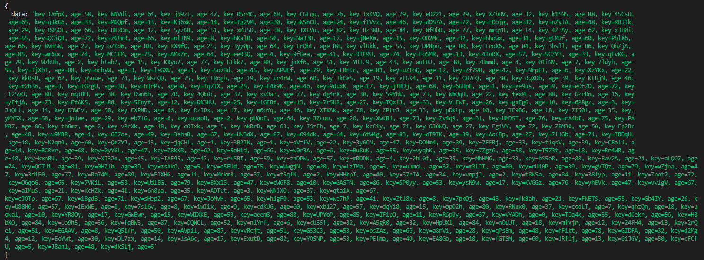

# Contagem de idade

Esse é um projetinho simples.

Nessa aplicação devemos solicitar uma chamada GET na API: https://coderbyte.com/api/challenges/json/age-counting que contém uma chave de dados e o valor. O objetivo da aplicação é contar quantos itens existem com idade igual ou superior a 50 anos. 
```

## Parte Codigo JavaScript

```javascript

const entradas = data.data.split(', ')

const idadesMaioresQue50 = entradas
.map(entrada => entrada.match(/age=(\d+)/)) 
.filter(match => match !== null)
.map(match => parseInt(match[1]))
.filter(idade => idade >= 50)
```

## ScreenShot do Retorno da API
<p align="center">

</p>


<h1 align="center">💻 Desenvolvido Por: Gilberto Júnior</h1>